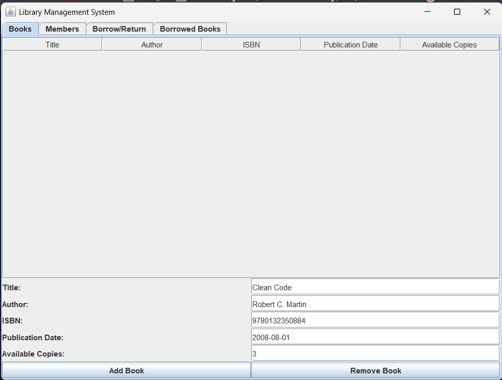
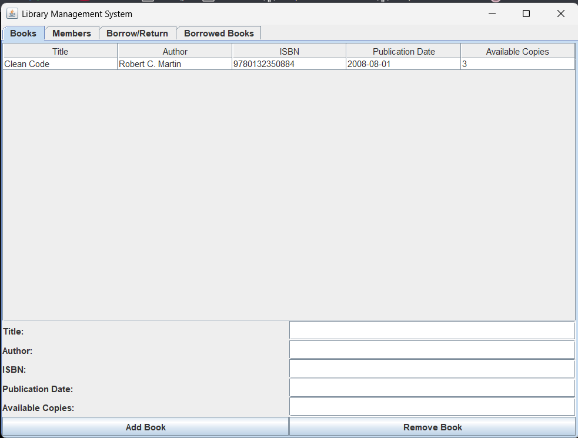
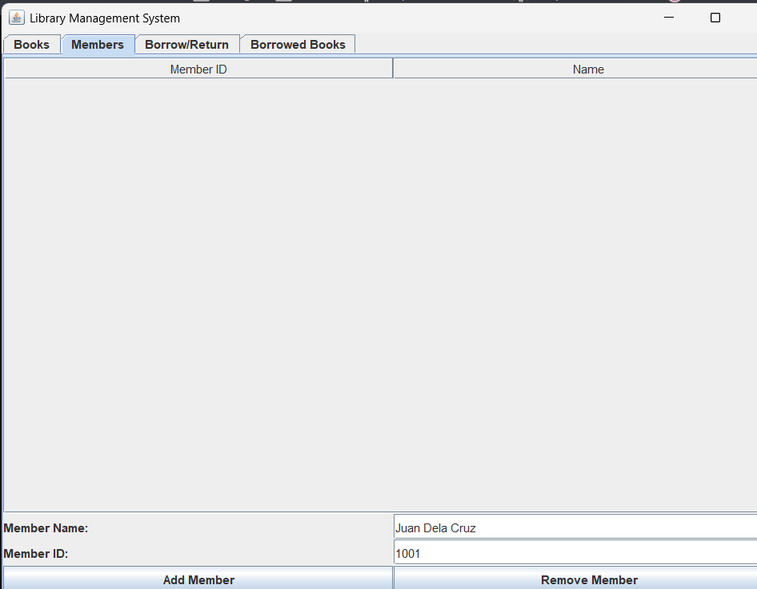
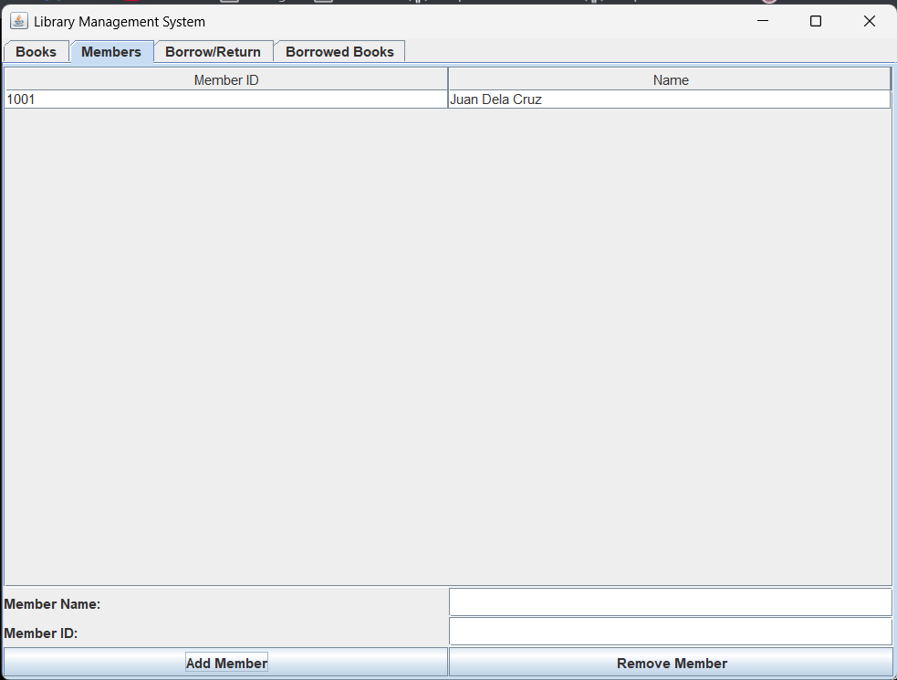
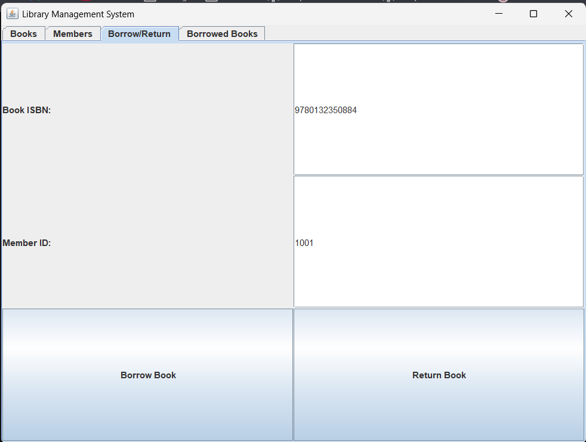

# Library Management System

A Java-based Library Management System with a graphical user interface built using Java Swing and persistent data storage using SQLite.

This project demonstrates core object-oriented programming concepts such as encapsulation, inheritance, abstraction, and basic polymorphism while providing features for managing books, members, and borrowing/returning transactions.

## Features

- Add and remove books
- Add and remove library members
- Borrow and return books
- View active borrowed-book records
- Tabbed Java Swing interface
- SQLite database storage
- Automatic database creation on first run

## Technologies Used

- Java
- Java Swing
- SQLite
- JDBC

## Project Structure

```text
library-management-system-java/
├── .gitignore
├── README.md
└── library-management-system/
    ├── assets/
    │   ├── sample-output.png
    │   ├── sample-output2.png
    │   ├── sample-output3.png
    │   ├── sample-output4.png
    │   ├── sample-output5.png
    │   ├── sample-output6.png
    │   └── sample-output7.png
    ├── lib/
    │   └── sqlite-jdbc-3.47.1.0.jar
    └── src/
        ├── Author.java
        ├── Book.java
        ├── DatabaseHelper.java
        ├── Librarian.java
        ├── Library.java
        ├── LibraryGUI.java
        ├── LibraryItem.java
        ├── Member.java
        └── Person.java
```

> Note: `library.db` is generated automatically when the program runs and is ignored by Git.

## How to Run

### Windows PowerShell

1. Clone the repository:

```powershell
git clone https://github.com/TimNieto/library-management-system-java.git
```

2. Go to the project folder:

```powershell
cd library-management-system-java\library-management-system
```

3. Compile the program:

```powershell
javac -cp ".;lib\sqlite-jdbc-3.47.1.0.jar" -d out src\*.java
```

4. Run the program:

```powershell
java -cp ".;out;lib\sqlite-jdbc-3.47.1.0.jar" LibraryGUI
```

### macOS/Linux

1. Clone the repository:

```bash
git clone https://github.com/TimNieto/library-management-system-java.git
```

2. Go to the project folder:

```bash
cd library-management-system-java/library-management-system
```

3. Compile the program:

```bash
javac -cp ".:lib/sqlite-jdbc-3.47.1.0.jar" -d out src/*.java
```

4. Run the program:

```bash
java -cp ".:out:lib/sqlite-jdbc-3.47.1.0.jar" LibraryGUI
```

## Sample Output

### Books Tab



### Members Tab



### Borrow and Return Tab



### Borrowed Books Tab


### Additional Screenshots






## Database Notes

The application uses SQLite for local data storage.

When the program runs for the first time, it automatically creates the required database tables:

- Books
- Members
- BorrowedBooks

The generated `library.db` file is ignored by Git so personal or test data is not uploaded to the repository.

## OOP Concepts Used

- **Encapsulation**: Classes use private fields with public getters and setters.
- **Inheritance**: `Member` and `Librarian` extend the abstract `Person` class.
- **Abstraction**: `Person` is an abstract class and `LibraryItem` is an interface.
- **Polymorphism**: Classes override shared borrowing and returning behaviors.

## Future Improvements

- Add search and filter features
- Add edit/update options for books and members
- Add login functionality for librarians
- Improve date validation
- Add export reports for borrowed books

## License

This project is for educational and portfolio purposes only. All rights are reserved.

You may view the source code, but you may not copy, modify, distribute, or use this code without permission from the author.

## Author

Created by Tim Nieto.
## Author

Created by Tim Nieto.
